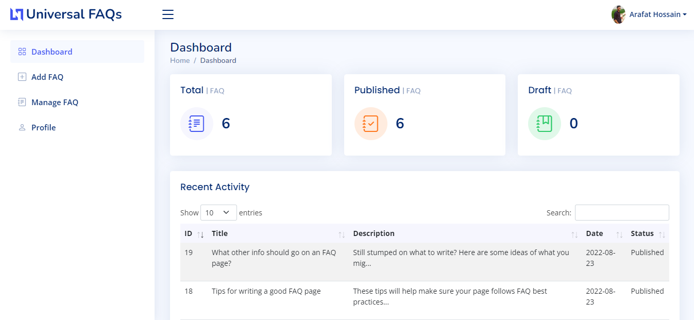
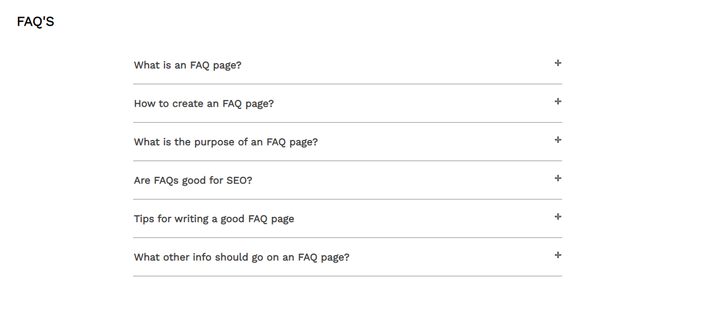

  
  <h1>Universal-FAQs</h1>
  
  

   Manage the FAQ section of your website like a pro.
  

  
  
  
  
  
  

### Dashboard

### Clientside View

<!-- Getting Started -->
## 	:toolbox: Getting Started

### It's super easy to integrate this on your website.

1. Login to your hosting manager and open file manager,
2. Download this project from github,
3. Create a folder `(ex: faq.yourdomain.com)` inside public_html folder and uplaod it inside that folder,
4. And finally, create a subdomain `(ex: faq.yourdomain.com)` and redirect to your (ex: faq.yourdomain.com) folder.

**Bingo! It's Done**

Now add `/admin` in your subdomain name `(ex: faq.yourdomain.com/admin)` and use `admin@email.com` as your email and `admin` as your password to login admin dashboard.
You can change your information anytime
<!-- License -->
## :warning: License

Distributed under the no License. See LICENSE.txt for more information.

<!-- Contact -->
## :handshake: Contact

Your Name - [Facebook](https://facebook.com/arafathossain000) - arafat.122260@gmail.com

Project Link: [https://github.com/arafat-web/Universal-FAQs](https://github.com/arafat-web/Universal-FAQs)

